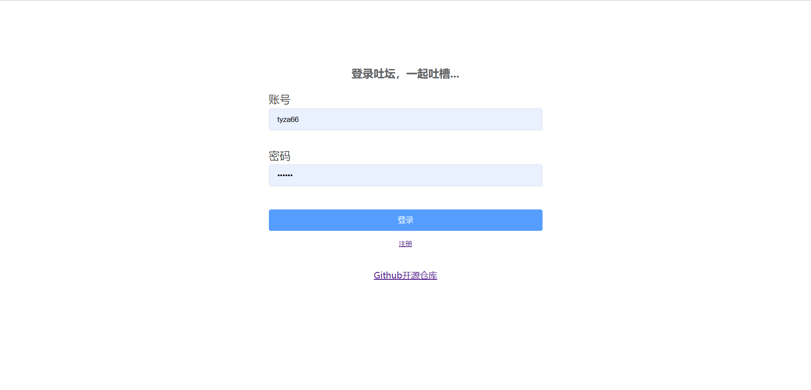
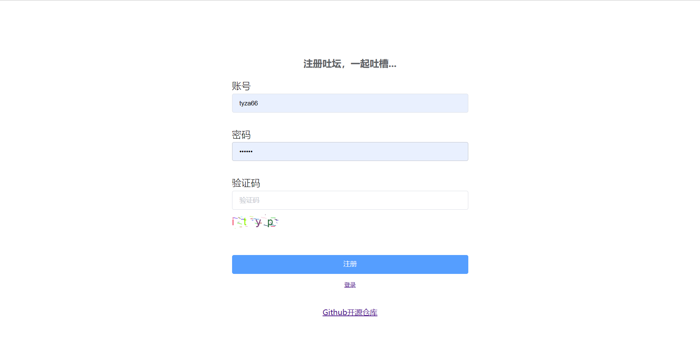
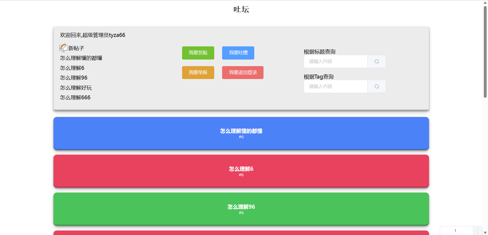
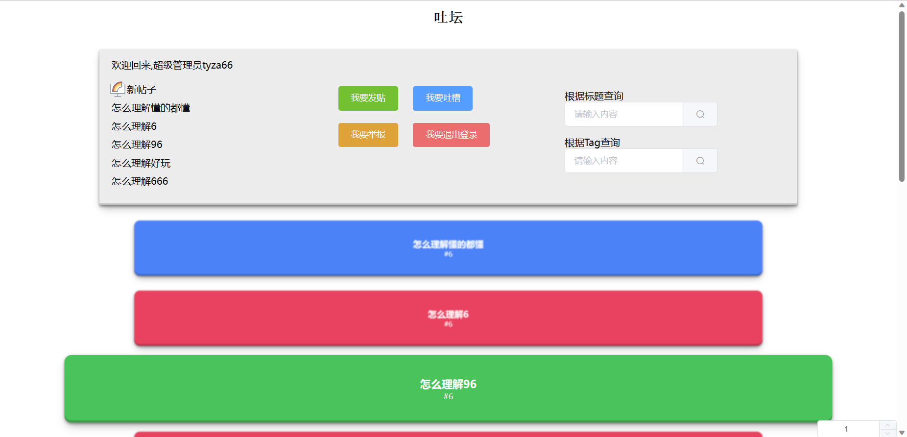
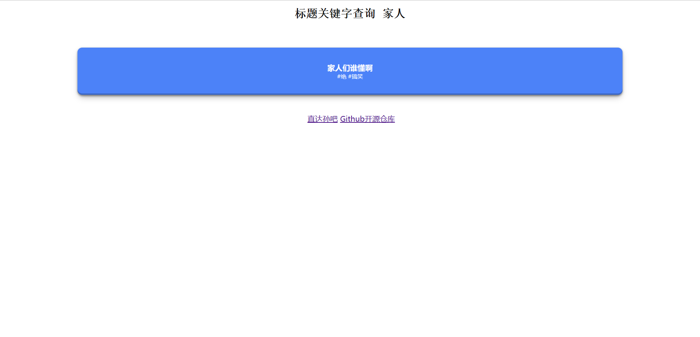
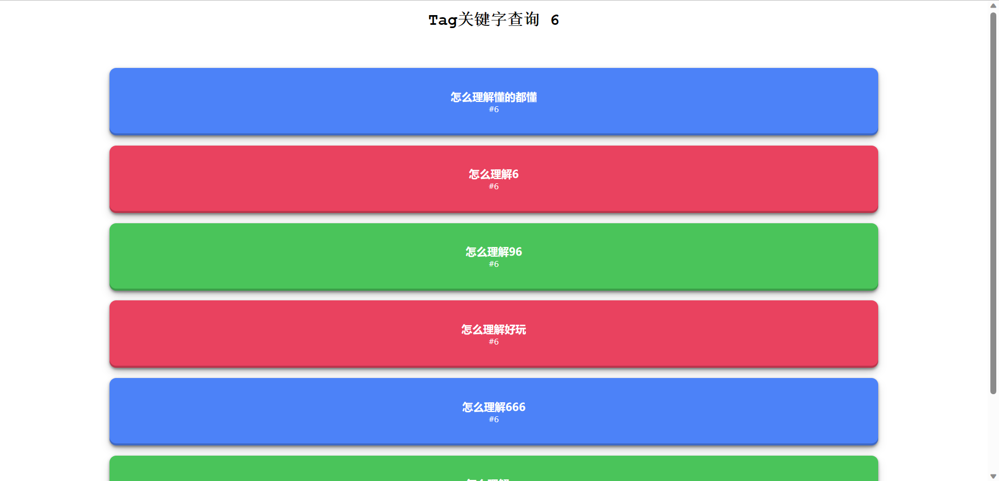
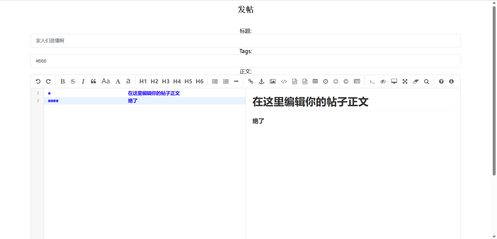

# ToForum
### 吐坛，吐槽专用论坛

登录界面

注册界面

首页

首页鼠标悬停在帖子上

标题查询

Tag查询

发帖

##### 说明
- 现在是开源开发阶段
- SpringBoot全栈项目
- 用户信息管理使用数据库为MySQL
- 论坛中的帖子使用MongoDB存储
- 鉴权和角色管理使用Sa-Token
- 存储在数据库中的用户密码使用SHA-1加密，而不是明文保存
- 使用Knife4j生成后端文档，访问地址为/doc.html
- 使用MyBatisPlus实现查询分页
- 模板引擎使用Thymeleaf
- 权限代码：0->超级管理员、1->普通管理员、2->普通用户
- 发帖和回帖使用MarkDown
- 鼠标悬停在某个帖子上的时候其他帖子会虚化一个度，鼠标点击某个帖子的时候会跳转到该帖子的详情页
- 将每个帖子的每个结构称为贴子体（PostStract），每个帖子由若干个帖子体组成，并且帖子结构使用MongoDB存储
- 预留账号admin，密码admin，权限为超级管理员
- 注册使用的图形验证码使用Hutool的验证码工具产生并且将原文存贮在了Session实现验证码验证
- 主页有点浅丑，后续可以改进一下，先把各种功能罗列出来
- 可以退出登录
- 可以分别使用标题关键字和Tag关键字查询帖子
- 发帖需要输入的三个框 一个是标题，一个是Tag，一个是MarkDown编辑器中编辑的帖子内容

##### 使用技术

- 后端：Spring、Spring Boot、MyBatis、MyBatis Plus、Knife4j、Spring-Boot-Data-MongoDB、Thymeleaf、Hutool
- 前端：Vue2.0、ElementUI、Axios、uiverse.io、Editor.md、marked

##### 本地复现

1. 创建数据库表
2. 拉取maven依赖
3. 运行项目
4. 访问localhost:8080体验

By：tyza66(洮羱芝闇)